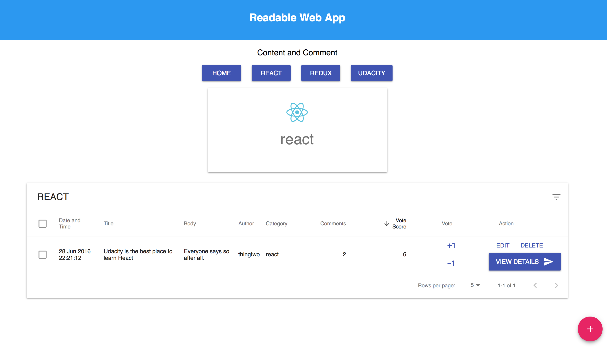
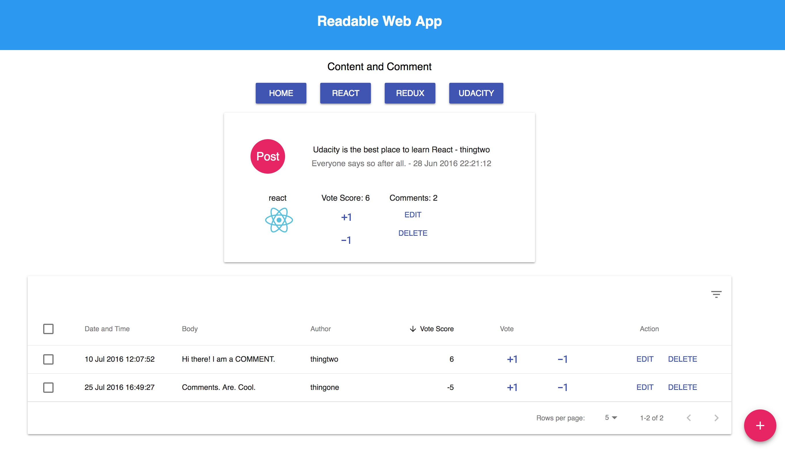
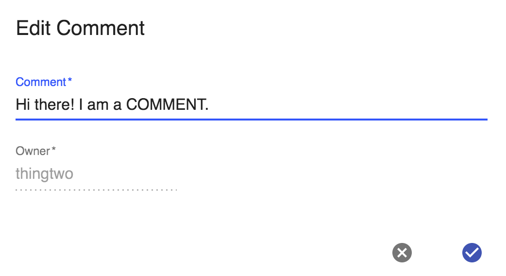

# Readable
---

## Project Purpose:

Readable is content and comment web app. Users will be able to post content to predefined categories, comment on their posts and other users' posts, and vote on posts and comments. Users will also be able to edit and delete posts and comments.

The project emphasizes using React with Redux, Routing and Thunk. Material-UI was used to improve user experience. 

## How to Load the App
The project uses Node.js and the Create-React-App starter.  If you do not have Node >= 6.x installed, you can download it here: [Node.js](https://nodejs.org/en/)

Once Node is installed, navigate to the directory where you want to store the app
```
git clone https://github.com/kuwatly/Readable-React.git
cd Readable-React/api-server
npm install
cd ..
npm install
```

Once all of the dependencies have been installed you can launch the server with
```
cd api-server
npm start
```

And you can launch the app with
```
npm start
```

A new browser window should automatically open displaying the app.  If it doesn't, navigate to [http://localhost:3000/](http://localhost:3000/) in your browser







## API Server

Information about the API server and how to use it can be found in [API README file](api-server/README.md)

## How to Use the App
* Posts are divided into three pre defined categories: React, Redux and Udacity
* Posts table allows for easy sorting by date and time, title, body, author, category, comments and vote
* Post details allows users to edit or delete a post as well as vote up or down
* Comments table allows for easy sorting by date and time, body, author and  vote

## License
Readable is released under the [MIT License](https://opensource.org/licenses/MIT).
